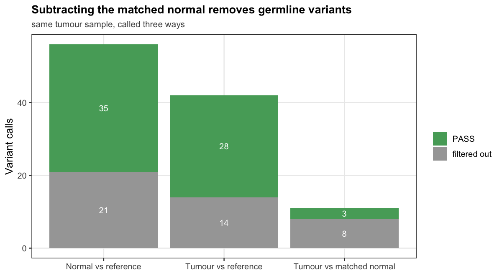
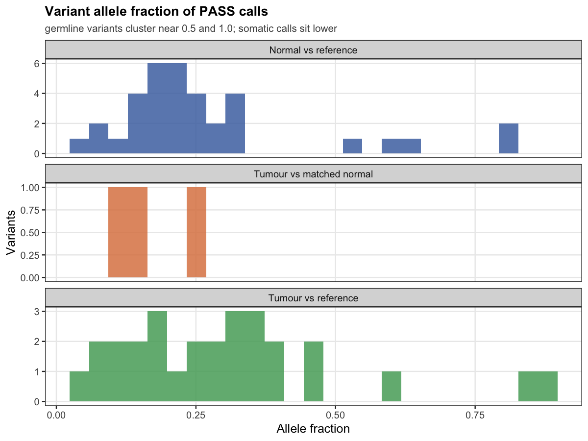
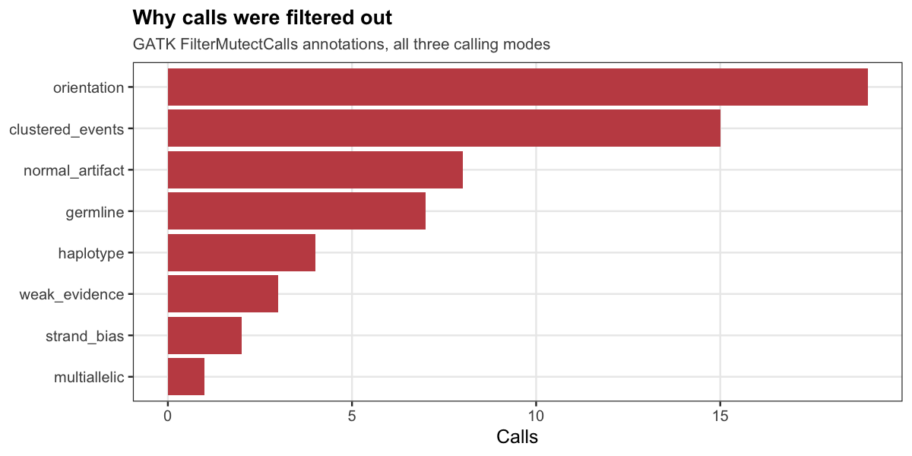
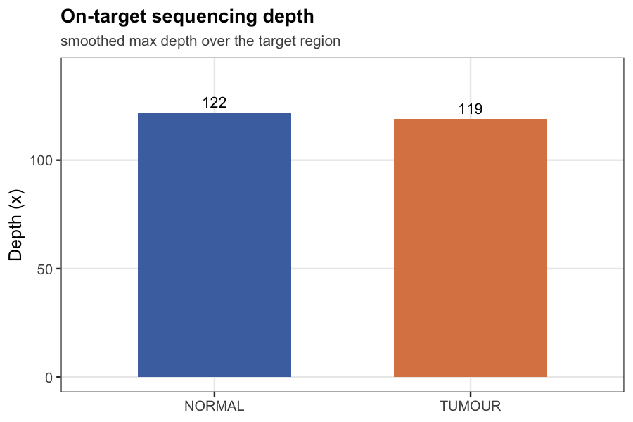

# Worked example: matched tumour/normal somatic calling

A complete run of the somatic pipeline on a small public tumour/normal pair, start to
finish, in about two minutes on a laptop. The figures below were produced by the pipeline
and are committed here, so you can see the output without running anything.

Reproduce it with:

```bash
./test/run_test.sh
Rscript example/make_figures.R test/data/results
```

## The data

A matched tumour/normal pair from
[nf-core/test-datasets](https://github.com/nf-core/test-datasets/tree/sarek) (sarek
branch): subsampled human reads spanning several sequencing lanes, plus a ~800 kb
reference subset with matching dbSNP and gnomAD resources.

The test script aligns the FASTQs with `bwa mem`, merges the per-lane BAMs, and hands the
result to the pipeline — so the example exercises the real path from reads to calls rather
than starting from pre-made BAMs.

| Sample | Role | Reads |
|---|---|---|
| `TUMOUR` | tumour | ~5,500 across 6 lanes |
| `NORMAL` | matched normal | ~5,500 across 5 lanes |

Achieved depth was ~120x over the target region, and GATK's contamination estimate for the
tumour was 0.

## What ran

```
read groups → BQSR → Mutect2 → orientation-bias + contamination filtering → depth → report
```

Mutect2 was run two ways on the same tumour: against the reference alone
(tumour-vs-reference, which is what you use when no normal is available) and against the
matched normal (tumour-vs-normal). Annotation (CADD, Funcotator) is switched off here —
those databases are hundreds of gigabytes and are not needed to demonstrate calling.

## Results

**The matched normal is what separates somatic from germline.** The same tumour sample
yields 28 PASS calls against the reference alone, but only 3 once the normal is
subtracted — the rest are the patient's inherited variants, which also appear in their
normal sample.



That is the entire point of paired calling, and it is the single most common way a
tumour-only analysis misleads: without a normal, inherited variants are indistinguishable
from acquired ones.

| Calling mode | Total calls | PASS |
|---|---|---|
| Normal vs reference | 56 | 35 |
| Tumour vs reference | 42 | 28 |
| **Tumour vs matched normal** | **11** | **3** |

The three surviving somatic candidates are at `chr1:132290 T>C`, `chr1:132782 G>A` and
`chr1:135554 G>A`.

**Allele fractions behave as expected.** Germline variants cluster near 0.5 (heterozygous)
and 1.0 (homozygous); the paired somatic calls sit lower, consistent with a subclonal
population rather than an inherited allele.



**Filtering is transparent.** Every call that did not pass carries the GATK annotation
explaining why, rather than being silently dropped.





## Full output

The run also produces a self-contained HTML report
(`results/09_report/somatic_report.html`) covering run configuration, depth and
contamination QC, variant counts, allele-fraction distributions and provenance, with
interpretation caveats stated inline. Because annotation is disabled here, the
gene-level and deleteriousness sections are omitted automatically rather than failing —
the report adapts to how the pipeline was configured.

Selected tables are committed under [`results/`](results/).

## Reading these numbers honestly

This is a deliberately tiny dataset: a few thousand reads over a ~200 kb region, with
three surviving somatic candidates. It demonstrates that the pipeline runs correctly end
to end and that matched-normal subtraction behaves as it should — it is not a biological
finding, and three calls is far too few to say anything about a real tumour. The
contamination estimate of 0 comes with an error of 1.0, meaning the data is too sparse to
estimate it, which the report states rather than hiding.

The example uses a GRCh37-based reference subset because that is what exists at this size
in the public test data; the pipeline's own configs target GRCh38, and `genome_version` is
set explicitly in the test config.
